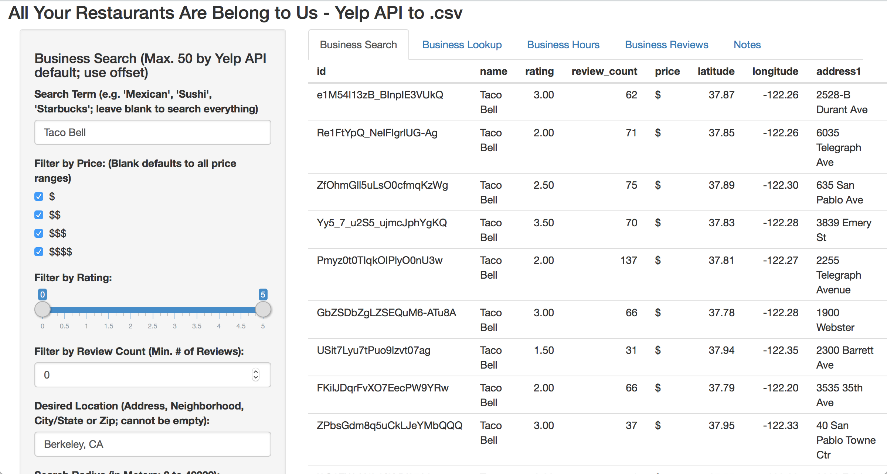
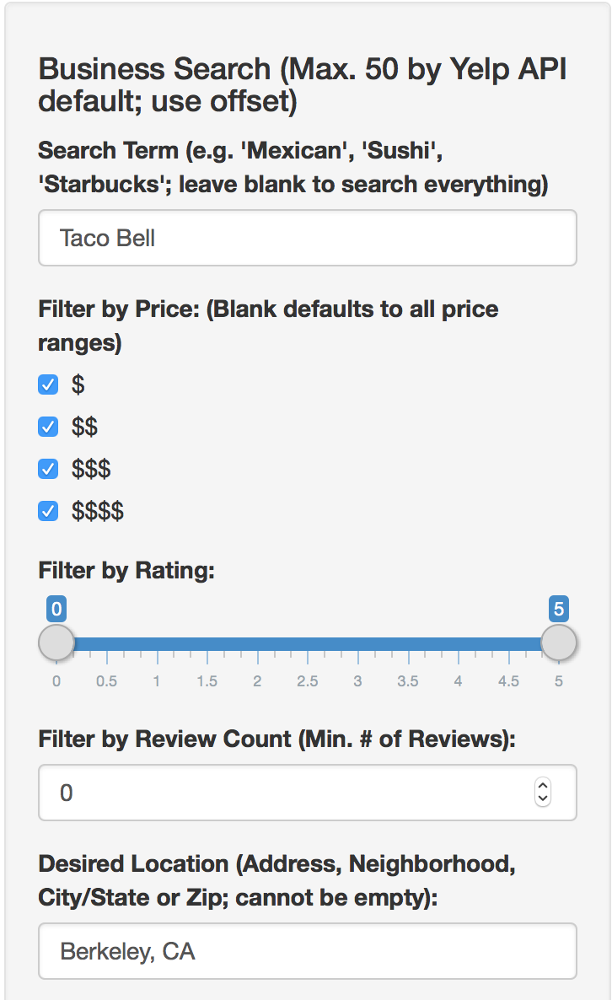
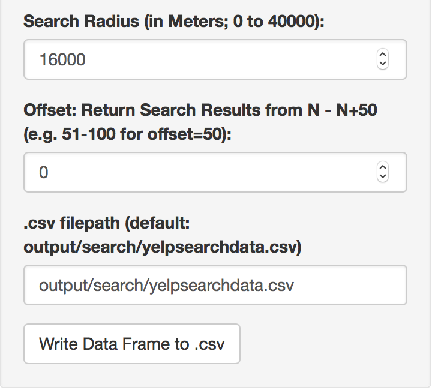
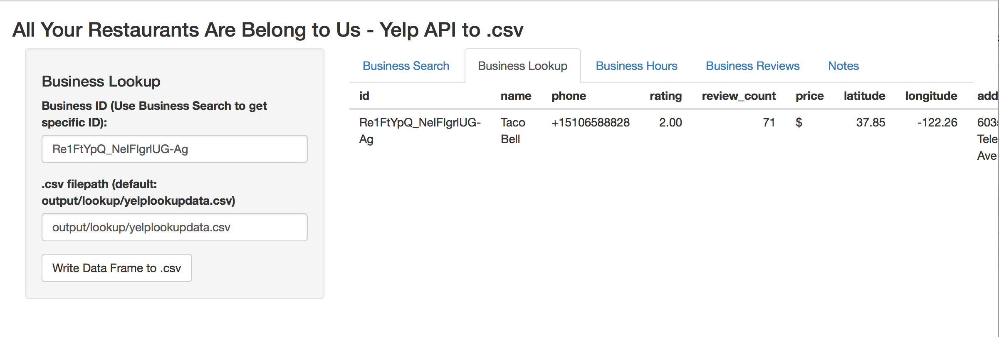
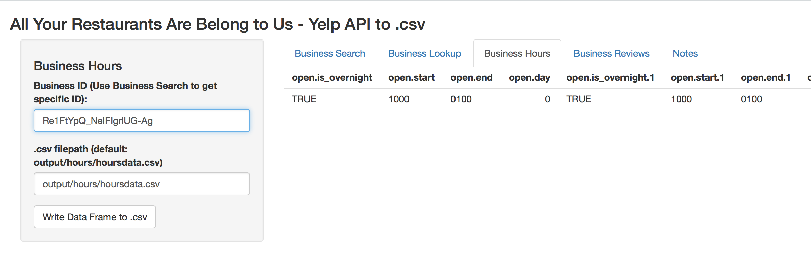
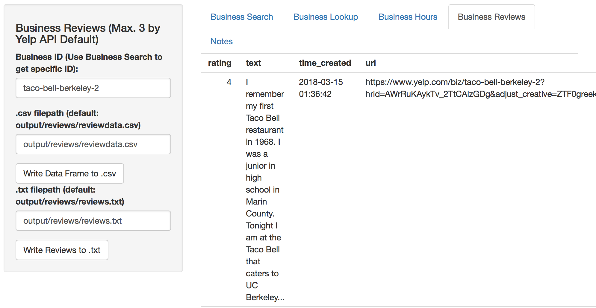

# All Your Restaurants Are Belong to Us: GUI Walkthrough

This page will give you a brief overview of how AYRABTS works, and examples of its GUI.

**Business Search page.**

The Business Search tab for filtering and downloading Yelp's Business Search data.

 

**Parameters to filter Business Search, Part 1.**

Additional filtering parameters for Business Search not shown in the first image, part 1.

 

**Parameters to filter Business Search, Part 2.**

Additional filtering parameters for Business Search not shown in the first image, part 1.

 

**Business Lookup page.**

The Business Lookup tab for filtering and downloading Yelp's Business Lookup data.

 

**Business Hours page.**

The Business Hours tab for filtering and downloading Yelp's Business Hours data.

 

**Business Reviews page.**

The Business Reviews tab for filtering and downloading Yelp's Business Reviews data.
